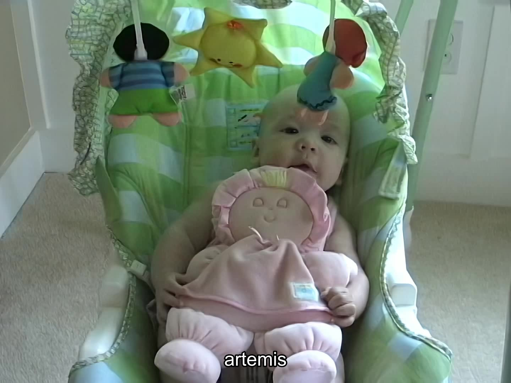
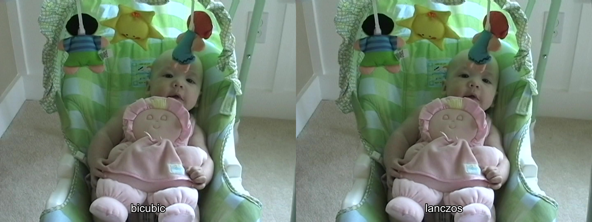
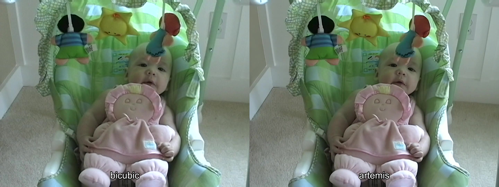
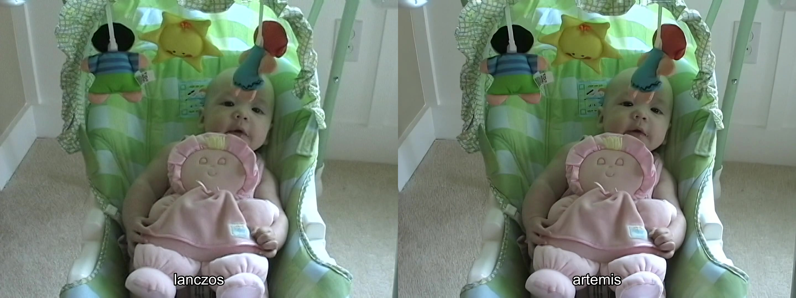
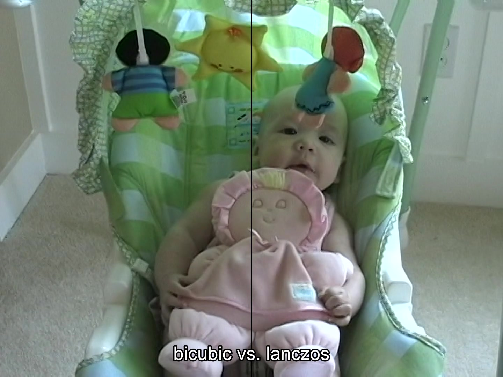
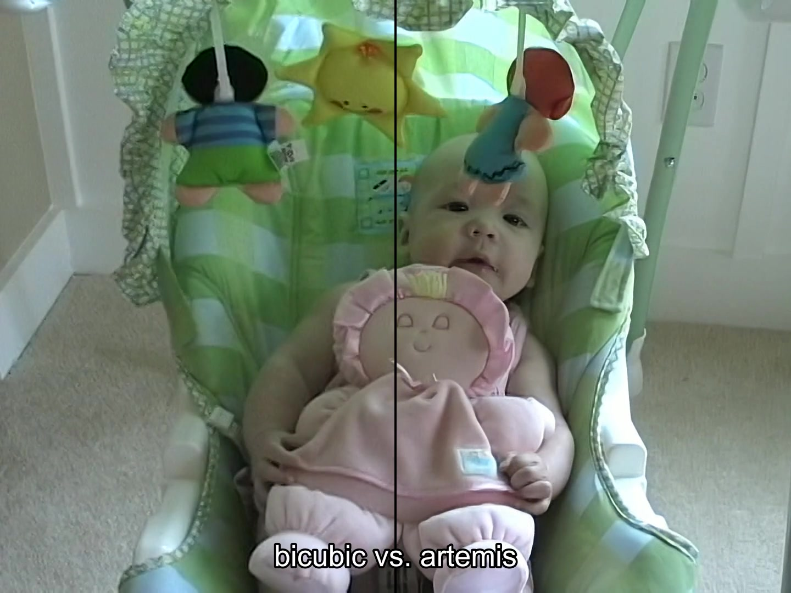
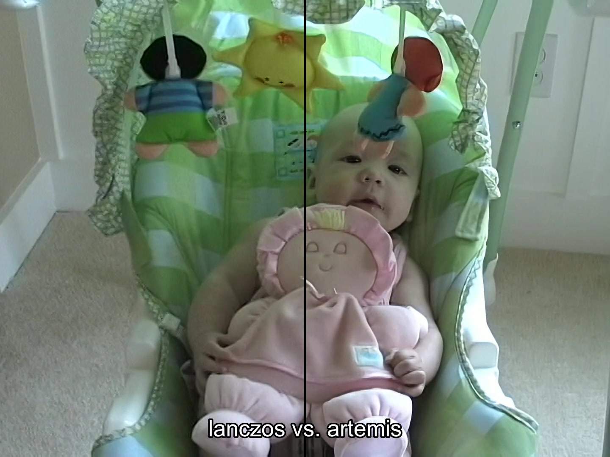
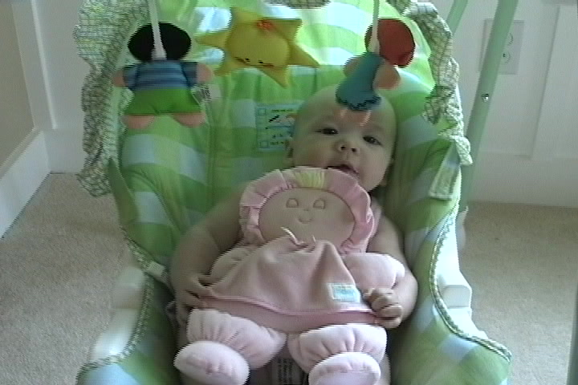

# Upscaling miniDV SD (480p) Video to HD (1080p) Video

## Prerequisites

This how-to assumes you have been able to pull footage off an old camcorder and have .dv files that contain the content you want to edit and upscale from 480p to 1080p.  You can do this by using [WinDV](http://windv.mourek.cz/) to extract data off your old camcorder (or one you get off ebay).

## Upscaling Method Comparisons

Here are some video encoding comparisons to show the difference between Bicubic, Lanczos, and Artemis LQ upscaling (from 480p to 1080p) on a sample clip taken from a miniDV camcorder.

Sample upscaling using each method (see https://ffmpeg.org/ffmpeg-filters.html#subtitles-1 for adding subtitles to comparisons):

<table>
	<tr>
		<th>Bicubic</th>
		<th>Lanczos</th>
		<th>Artemis</th>
	</tr>
	<tr>
		<td><a href="https://drive.google.com/file/d/18dHpIBo6D94n_xgGodMyX0uAODjSFaQ4/view?usp=sharing"></a></td>
		<td><a href="https://drive.google.com/file/d/1f-DHb_HQRwJB0qMVCu8ScXOItmT5mbgQ/view?usp=sharing"></a></td>
		<td><a href="https://drive.google.com/file/d/1rWfJ2rZImn0crlUTz3JzJL3eRt2zqcPX/view?usp=sharing"></a></td>
	</tr>
</table>

```console
ffmpeg -i sample.dv -vf yadif,scale="1440:1080":flags=bicubic,setsar=1 -vcodec libx264 -preset veryslow -profile:v high -pix_fmt yuv420p -crf 17 -acodec ac3 -metadata:s:a:0 language=eng sample.1440x1080.bicubic.mp4
ffmpeg -i sample.dv -vf yadif,scale="1440:1080":flags=lanczos,setsar=1 -vcodec libx264 -preset veryslow -profile:v high -pix_fmt yuv420p -crf 17 -acodec ac3 -metadata:s:a:0 language=eng sample.1440x1080.lanczos.mp4
ffmpeg -i sample.dv -vf yadif,scale="640:480",setsar=1 -vcodec rawvideo -pix_fmt yuv420p -acodec aac -metadata:s:a:0 language=eng sample.640x480.artemis.avi (then upscaled by VEAI)
```

Side by side comparisons of each method:

<table>
	<tr>
		<th>Bicubic vs. Lanczos</th>
		<th>Bicubic vs. Artemis</th>
		<th>Lanczos vs. Artemis</th>
	</tr>
	<tr>
		<td><a href="https://drive.google.com/file/d/1oUeqMl5Q10lus7rWFZNuXx1k2ke1mn4C/view?usp=sharing"></a></td>
		<td><a href="https://drive.google.com/file/d/1yzVmM_SlTc5JvNrr1BnLThc1VLNd6CXC/view?usp=sharing"></a></td>
		<td><a href="https://drive.google.com/file/d/180MsjZ8bRWbvbGYWgtvf8dSpelcwv7Hj/view?usp=sharing"></a></td>
	</tr>
</table>

```console
ffmpeg -y -i sample.1440x1080.bicubic.mp4 -i sample.1440x1080.lanczos.mp4 -filter_complex hstack -crf 17 -preset veryslow sample.sxs.bicubic.vs.lanczos.mp4
ffmpeg -y -i sample.1440x1080.bicubic.mp4 -i sample.1440x1080.artemis.mp4 -filter_complex hstack -crf 17 -preset veryslow sample.sxs.bicubic.vs.artemis.mp4
ffmpeg -y -i sample.1440x1080.lanczos.mp4 -i sample.1440x1080.artemis.mp4 -filter_complex hstack -crf 17 -preset veryslow sample.sxs.lanczos.vs.artemis.mp4
```

Split screen comparisons of each method:

<table>
	<tr>
		<th>Bicubic vs. Lanczos</th>
		<th>Bicubic vs. Artemis</th>
		<th>Lanczos vs. Artemis</th>
	</tr>
	<tr>
		<td><a href="https://drive.google.com/file/d/1FWwZY-d08sEa8ms_iayjidSC5DYjKGXv/view?usp=sharing"></a></td>
		<td><a href="https://drive.google.com/file/d/18yuLThkUQGlNh-w-xQGoQhr1QIX_cVsD/view?usp=sharing"></a></td>
		<td><a href="https://drive.google.com/file/d/12wuVJNXOK-5QZyt0h6vHN_dBoobC2LUw/view?usp=sharing"></a></td>
	</tr>
</table>

```console
ffmpeg -t 60 -s 4x1080 -f rawvideo -pix_fmt rgb24 -r 30 -i /dev/zero empty.mp4
ffmpeg -y -i sample.1440x1080.bicubic.mp4 -i empty.mp4 -i sample.1440x1080.lanczos.mp4 -filter_complex "[0]crop=iw/2-2:ih:0:0[left]; [2]crop=iw/2-2:ih:iw/2+2:0[right]; [left][1:v:0][right]hstack=inputs=3" -crf 17 -preset veryslow sample.split.bicubic.vs.lanczos.mp4
ffmpeg -y -i sample.1440x1080.bicubic.mp4 -i empty.mp4 -i sample.1440x1080.artemis.mp4 -filter_complex "[0]crop=iw/2-2:ih:0:0[left]; [2]crop=iw/2-2:ih:iw/2+2:0[right]; [left][1:v:0][right]hstack=inputs=3" -crf 17 -preset veryslow sample.split.bicubic.vs.artemis.mp4
ffmpeg -y -i sample.1440x1080.lanczos.mp4 -i empty.mp4 -i sample.1440x1080.artemis.mp4 -filter_complex "[0]crop=iw/2-2:ih:0:0[left]; [2]crop=iw/2-2:ih:iw/2+2:0[right]; [left][1:v:0][right]hstack=inputs=3" -crf 17 -preset veryslow sample.split.lanczos.vs.artemis.mp4
```

**Original miniDV Sample Clip**
<p><a href="https://drive.google.com/file/d/1li2k33yte_PwajIoNXFwGstyBjAR9wOT/view?usp=sharing"></a></p>

During my research, I also tried [iSIZE AI Upscaling](https://www.isize.co/upscale/) but ruled it out since there were flashing black frames being encoded by their AI algorithm.

**iSize Sample**
</p><a href="https://drive.google.com/file/d/1j5iPQe7Vk2AesD6YFdTVQ7n_W9rjJZtY/view?usp=sharing"></a><p>

In my opinion, the upscaling methods ranked from best to worst are:
- Artemis
- Lanczos
- Bicubic
- iSize

## Step 1: Edit the Raw Footage

Get [Shotcut](https://shotcut.org/) (available for all platforms).

Open the source.dv file in Shotcut and drag it to the timeline.  
*My suggestion is to cut each distinct video clip into separate clip.dv files.*

When you go to save the clips:  
Select ```camcorder:DV (SD NTSC)``` (*in my case, this is my original format*) and then select ```export```.  
*This dumps the clips without encoding them (lossless).*

You can use this tool to convert other types of file to .dv format as well.  
*In my case, I used iMovie to create a bunch title.mp4 files and subtitle.mp4 files to describe the clips and used Shotcut to turn them into .dv files.*

*Example list of files after editting:*
```
00.title.dv (built in iMovie; converted to .dv with Shotcut)  
05.subtitle.segment.1.dv (built in iMovie; converted to .dv with Shotcut)  
10.movie.segment.1.dv (used Shotcut to crop out and export this segment)  
15.subtitle.segment.2.dv (built in iMovie; converted to .dv with Shotcut)  
20.movie.segment.2.dv (used Shotcut to crop out and export this segment)  
```
Once you have edited your movie and have a list of ordered the clips, you just concatenate them together.  (Yes. really!)

*On Mac:*
```console
hostname$ cat *.dv > movie.dv
```
*On Windows:*
```console
C:\> copy 00.title.dv + 05.subtitle.segment.1.dv + 10.movie.segment.1.dv + 15.subtitle.segment.2.dv + 20.movie.segment.2.dv movie.dv
```

## Step 2: Understand the Square Pixel Problem

Get [FFmpeg](https://ffmpeg.org/download.html) (available for all platforms)  

Get the media information off your movie.dv using ffmpeg:  
```console
ffmpeg -i movie.dv  
```
Your output will contain a section like this:  
```
Duration: 01:00:00.00, start: 0.000000, bitrate: 28771 kb/s  
  Stream #0:0: Video: dvvideo, yuv411p, 720x480 [SAR 8:9 DAR 4:3], 25000 kb/s, 29.97 fps, 29.97 tbr, 29.97 tbn, 29.97 tbc  
  Stream #0:1: Audio: pcm_s16le, 48000 Hz, stereo, s16, 1536 kb/s  
```
Here are some terms:  
```
DAR = Display Aspect Ratio  
PAR = Pixel Aspect Ratio  
SAR = Storage Aspect Ratio  
```
FFmpeg uses the unfortunate term variation:

SAR = Sample Aspect Ratio (equivalent to PAR).  I will continue to use the terms above.

The video math for our movie says:
```
DAR = PAR * SAR  
4:3 = 8:9 * 720:480  
4/3 = (8/9) * (720/480)  
4/3 = (8*720) / (9*480)  
4/3 = 5760 / 4320  
1.33 = 1.33  
```
However, to accurately upscale the movie, we need to have a PAR of 1:1 (square pixels) not 8:9 (non-square pixels)!

## Step 3: Upscaling - Option 1 (not using AI processing):
*Skip this step if you are going to use AI processing.  This is provided for those that find AI processing too time consuming or costly.  I started down this route until I found option 2.*

Simply transform and encode the final output:
```console
ffmpeg -y -i movie.dv -vf yadif,scale="1440:1080":flags=lanczos,setsar=1,pad="1920:1080:240:0" -vcodec libx264 -preset veryslow -profile:v high -pix_fmt yuv420p -crf 17 -acodec ac3 -metadata:s:a:0 language=eng final.mp4
```
```
-vf (video filter)  
	yadif, (deinterlace the video)  
	scale="1440x1080":flags=lanczos, (SAR: upscaled resolution using lanczos method)  
	setsar=1, (PAR)  
	pad="1920:1080:240:0" (pad left and right since original is 4:3 and we are creating 16:9)  
-vcodec libx264 (encoding codec)  
-preset veryslow (best compression)  
-profile:v high (high profile)  
-pix_fmt yuv420p (pixel format)  
-crf 17 (visually lossless)  
-acodec ac3 (bluray compatible audio)  
-metadata:s:a:0 language=eng (audio metadata: English)  
```
## Step 3: Upscaling - Option 2 (prepare for AI processing)

For this option, we only need to deinterlace and set a PAR of 1:1 without encoding:
```console
ffmpeg -i movie.dv -vf yadif,scale="640:480",setsar=1 -vcodec rawvideo -acodec copy -pix_fmt yuv420p -metadata:s:a:0 language=eng movie.avi
```
*The output has a resolution of 640x480 (4:3) with a PAR of 1:1 (square pixels).*  
```
-vcodec rawvideo (do not encode; lossless)
-acodec copy (copy stream; lossless)

(see option 1 for other select parameter descriptions)
```
## Step 4: AI Upscaling

Get [Topaz **V**ideo **E**nhance **AI**](https://topazlabs.com/video-enhance-ai/) (there is a free trial for 30 days).

I have powerful Macbook Pro (no GPU) and it would be infeasible to process more than 30 minutes of video without spending days or weeks using only the CPU on my machine.

**You will NEED a GPU!** (*or a cloud instance with one; see below*)

However, you should process a few minutes of video locally to see what the quality is like and to experiment with the tool.

Basically, just add the movie.avi file  and select the following options in the tool:
```
A.I. Models: Artemis-LQ: P,LQ,MC
Preset: HD(1920x1080)
Unselect: Crop to fill frame
Scale: 225
Width: 1920
Height: 1080
Select: Use default output name
Output format: mpeg4
```
We will use the Artemis LQ model since it is designed for "Enhancement and upscaling for low-quality progressive footage with better motion consistency. Use this for old family recordings, historical footage, etc."  
Unselecting ```Crop to fill frame``` will make the video 16:9 (widescreen) with black bar padding on the left and right.

Simple Steps:
- Open your input source (generated in Step 3 - Option 2)
- Select the options above
- Under ```Process``` on the main menu make sure your GPU is selected
- Adjust the timeline to enhance and encode either the entire video or just a sample
- Select ```Process -> Start Processing```

This will show a frame by frame comparison and enhancement while processing.  
Inspect the final video when processing is complete.  

## Step 5: Using AWS Cloud Computing to Upscale

**Note:** I tried to use an Elastic GPU attached to a T3 instance and VEAI would not recognize the GPU.  

*VEAI requires the installation of NVidia drivers for GPU detection even though Elastic GPUs provide OpenGL support. That means at a minimum you are going to require a G3 accelerated instance.*

Understand AWS instance types and costs by reading these pages:  
- AWS accelerated computing: https://aws.amazon.com/ec2/instance-types/#Accelerated_Computing
- AWS pricing: https://aws.amazon.com/ec2/pricing/on-demand/

You will need at least a g3s.xlarge to meet the minimum system requirements:  
https://help.topazlabs.com/hc/en-us/articles/360039302251-Video-Enhance-AI-System-Requirements

If you have a basic account with AWS, you will also need to request a limit increase from 0 to 1 for G type instances:  
https://console.aws.amazon.com/support/home#/case/create

It will take 24 hours to assign the request, and 24-48 hours for a review of your account to grant the increase.

At the time of writing this, it will cost ~$1 per hour to run this machine.  Have everything ready to go before launching your GPU instance to minimize costs.

### Preparing a Video EBS Volume Using a Small T3 Instance:
*Use a T3 instance to setup the video EBS volume so you are not charged for accelerated machine usage during setup.*

Basically, you need to upload all the files you need to S3 from your local machine.

This includes:
- AWS CLi Tools: https://docs.aws.amazon.com/cli/latest/userguide/install-cliv2-windows.html
- Topaz Video Enhance AI (paid for or trial version): https://topazlabs.com/video-enhance-ai/
- Gzip: http://gnuwin32.sourceforge.net/packages/gzip.htm (you only need to put gzip.exe from the package into S3)
- Your preprocessed videos (Step 3 - Option 2)

You can do this via the web interface or via AWS CLI tools:
```console
brew install awscli
```
*or see below how to get the Windows AWS CLI tools.*

*I suggest you zip each file up before uploading to S3 to save transfer time and costs:*
```console
gzip --best movie.avi
```

Create an EBS volume that does not get deleted when you tear down your instances.  
*I created a 1TB SSD since I had a lot of video to process.*  
**Note**: You are charged for this EBS volume whether it is attached to a running instance or not so build and destroy it in a timely fashion.

Spin up a cheap (small) T3 Windows 2019 DC Edition instance assigned a role allowing access to your S3 buckets.  
Attach the newly created EBS volume to the T3 instance and format the drive.  

Again, download the AWS CLI tools to the T3 instance using IE and install it so you can access your S3 buckets.  
Now use this cheap instance to copy the contents of your S3 bucket to your EBS volume (D:\).

*Example:*
```console
D:\> aws s3 cp s3://bucketname/input.avi.gz .
```
Once you have all the files on the EBS volume, decompress any .avi.gz files:
```console
gzip.exe -d input.avi.gz
```
Lastly, you will need to acquire AWS's specialized NVidia GRID drivers (the ones from the NVidia website will not work with this application on a cloud instance). Follow the instructions here to get NVIDIA.zip and put it on the EBS volume (D:\) as well:  
https://docs.aws.amazon.com/AWSEC2/latest/WindowsGuide/install-nvidia-driver.html#nvidia-GRID-driver

Now you have everything you need to quickly attach this EBS volume to your G3 instance and have access to all the files you need.

Shutdown your T3 instance making sure you do not delete the EBS volume you made.  
Detach the EBS volume from the T3 instance.

### Upscaling Using a XLarge G3 Instance:

After your G3 limits are increased:
- Spin up a g3s.xlarge instance with default parameters and a role that allows access to your S3 buckets.
- Attach the video EBS volume to the instance.
- Install the AWS CLI Tools from the EBS volume to access S3 (in order to put videos back into S3 as they finish).
- Install the NVidia GRID drivers.
- Reboot.
- Install these Windows features: Media Foundation and Quality Windows Audio Video Experience.
```console
enable-windowsoptionalfeature -online -featureName ServerMediaFoundation -all
enable-windowsoptionalfeature -online -featureName QWAVE -all
```
- Reboot.
- Install the Topaz Video Enhance AI Tool.
- Launch VEAI and ensure the GPU is select under Process.
- Select each video file to enhance along with the setting from the section above and queue each movie up for processing.
- Run all processing until complete.
- Either from you G3 instance (after each file is processed or upon batch completion) or from your T3 (reattached the EBS volume) copy all processed files back to S3.
- Download the processed files from S3 to your local system.
- Clean up all AWS resources including instances, volumes, s3 buckets, etc.

### AWS Cost Estimates
*costs as of when this page was authored*

EC2 Costs:  
video length (mins) * 0.44 (frames/sec) * 0.934 (cost/hr) * 0.5 = compute cost of g3s.xlarge instance

Example (60 mins of video):  
60 (mins) * 0.44 (frames/sec) * 0.934 (cost/hr) * 0.5 = $12.33

EBS Volume Costs:  
video length (mins) * 0.44 (frames/sec) * 0.1 (gb/month) * 1000 (gb) / 720 * 0.5 = 1TB EBS volume

Example (60 mins of video):  
60 (mins) * 0.44 (frames/sec) * 0.1 (gb/month) * 1000 (gb) / 720 * 0.5 = $1.83

## Step 6: Burning Videos to Blu-rays

There are just so many bad Blu-ray creators (used to author your blu-ray menus and add video content) on the market!

Here is a list of ones I tried before deciding:

- [DVDFab Blu-ray Creator](https://www.dvdfab.cn/blu-ray-creator.htm)
- [Leawo Blu-ray Creator](https://www.leawo.com/pro/blu-ray-creator.html)
- [Xilisoft Blu-ray Creator](http://www.xilisoft.com/blu-ray-creator-express.html)
- [Aiseesoft Blu-ray Creator](https://www.aiseesoft.com/blu-ray-creator/)
- [Wondershare Blu-ray Creator](https://dvdcreator.wondershare.com/)

I have a mac so I tried either the native MacOS version or used a Windows 10 VM (with burner device passthrough) for products that did not support MacOS.  Some creators created unplayable menus while others were missing sound, etc.  Use a free trial to test whatever you end up using before purchasing!

I purchased DVDFab Blu-ray Creator (MacOS version).  It has a few bugs that I tolerate. Other programs I previously used have slipped into disrepair with each new version released.  As of writing this, I am already using a previous version (11.0.9.7) of DVDFAb due to a bug in the scene selection menus.  So buyer beware!

In general, DVDFab is customizable enough to use and has one key feature. The key feature is the ability to select the bitrate as "same as source". Most other applications make you select a static bitrate such as 15Mbps, 20Mbps, or 30Mbps.  Since you have put all this time and energy into AI enhancing your video, you want to reduce or eliminate any re-encoding when burning it to physical media.  When re-encoding is unavoidable, you want a bitrate that matches or exceeds your original footage to reduce loss.  Selecting "same as source" allows you to match your original encoding bitrate without expanding your filesize with a larger bitrate.  Many products have you select a static bitrate for ALL the files on the disc regardless of the varying bitrates.  DVDFab customizes each video's bitrate when encoding from .mp4 to .m2ts.  This makes the blu-ray folder creation and the streams encoding fast compared to other methods.

You will want to create an .iso output file.  In my case, I created BD50 images (basically a ~50GB Dual Layer Blu-ray disc image).  I then used a 50GB BD-RE (rewritable) disc to test my images on blu-ray players before burning final BD-R DL discs.
