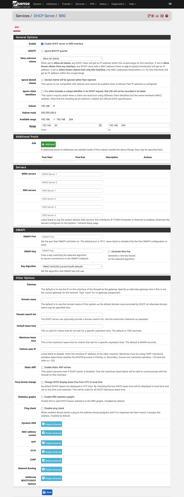

## Setup a IPV4 DHCP Server

source: [https://docs.netgate.com/pfsense/en/latest/services/dhcp/ipv4.html](https://docs.netgate.com/pfsense/en/latest/services/dhcp/ipv4.html).  

### Services>DHCP Server>BR0>General Options
* Enable: Enable DHCP server on BR0 interface: :white_check_mark:
* Range: From: ``192.168.XXX.50`` To: ``192.168.XXX.254``

### WebUI

