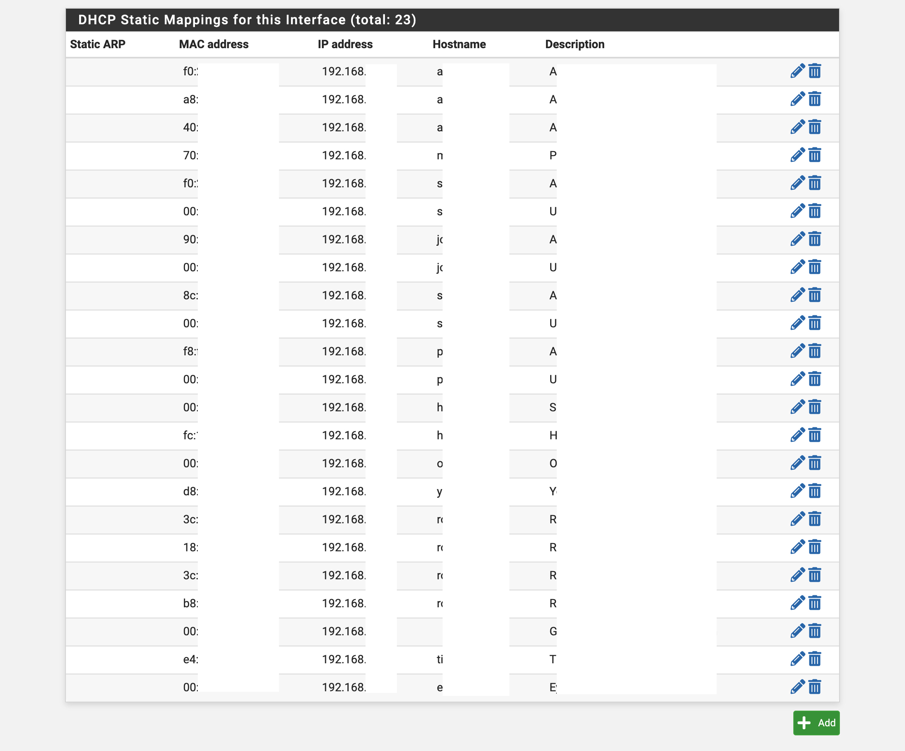

## Setup Static DHCP Reservations
source: [https://docs.netgate.com/pfsense/en/latest/services/dhcp/mappings-in-pools.html](https://docs.netgate.com/pfsense/en/latest/services/dhcp/mappings-in-pools.html).  

### Services/DHCP Server>BR0>DHCP Static Mappings for this Interface
* MAC Address: ``[xx:xx:xx:xx:xx:xx]``
* IP Address: ``192.168.XXX.[###]`` *(between 192.168.XXX.2 and 192.168.XXX.49)*
* Description: ``[Device Description]``
* Hostname: ``[device hostname]`` *(optional but recommended for DNS resolution)*

Repeat for each static mapping (reservation)  

### WebUI

