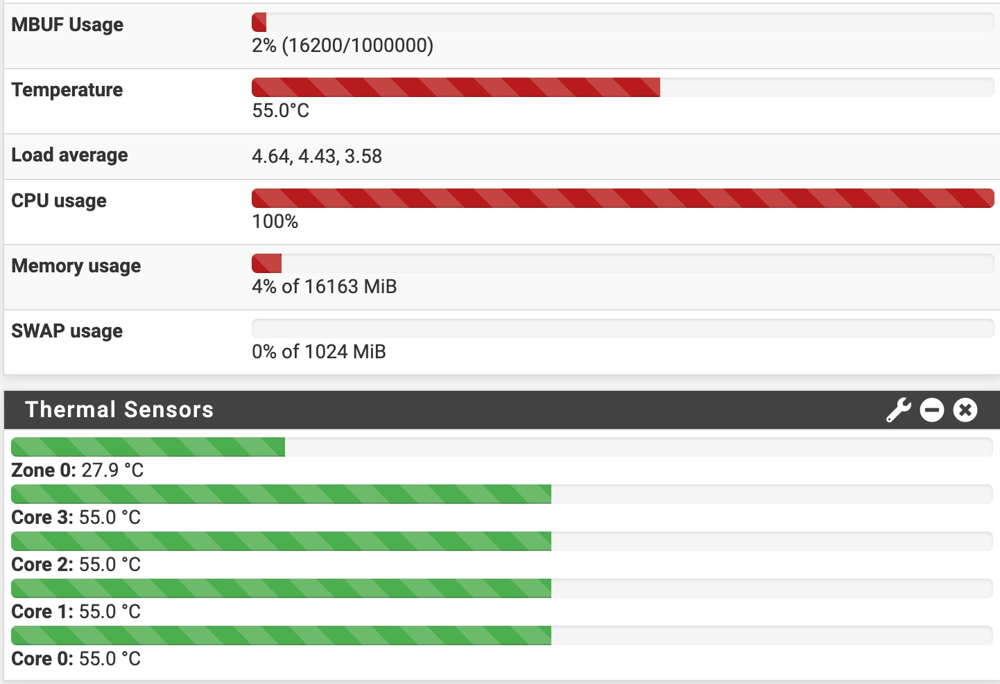

# pfSense Router

| ![routerfront] | ![routerback] |
|----------------|---------------|

[routerfront]: router.front.jpg
[routerback]: router.back.jpg

## Parts List

  
Parts

  
* [KingNovy Intel Celeron N5105 4x 2.5GbE](https://www.aliexpress.com/item/3256803806996430.html) ~$200
* [Crucial RAM 16GB Kit (2x8GB) DDR4 3200MHz CL22 (running @ 2933MHz) SODIMM](https://www.amazon.com/dp/B08C4WV6FT) $60
* [Intel SSDSA2CW120G3 320 Series 120GB SATA 3Gb/s 2.5" SSD](https://www.ebay.com/sch/i.html?_nkw=SSDSA2CW120G3) $20-$40 (I had one lying around)
* [FPV HDMI Cable, Kework 20cm FPV HDMI Slim Flat Cable, 90 Degree Downward Standard HDMI Male Interface to Standard HDMI Male Interface](https://www.amazon.com/dp/B07FHXF3LS) $16
* [VCE HDMI Coupler HDMI Female to Female Connector 4K HDMI to HDMI Adapter (2-Pack)](https://www.amazon.com/dp/B00V7SFR8Y) $6
* [Noctua NF-P12 redux-1700 PWM, High Performance Cooling Fan, 4-Pin, 1700 RPM (120mm, Grey)](https://www.amazon.com/dp/B07CG2PGY6) $15
* [Noctua NA-FC1, 4-Pin PWM Fan Controller (Black)](https://www.amazon.com/dp/B072M2HKSN) $25
* [Noctua NA-SAVP1 chromax.Grey, Anti-Vibration Pads for 120/140mm Noctua Fans (16-Pack, Grey)](https://www.amazon.com/dp/B07SWRXT3D) $9
* [Noctua NA-SAV4, Silicone Anti-Vibration Fan Mount Set (16-Pack, Brown)](https://www.amazon.com/dp/B071W6KYCG) $9
* [120mm Black Finger Grills (4 Pack)](https://www.amazon.com/dp/B01H0P7OC4) $8
* [Facmogu DC 12V 3A Power Adapter, 36 Watt AC 100-240V to DC 12V Transformers, Switching Power Supply for LCD Monitor, Wireless Router, CCTV Cameras 2.1mm X 5.5mm US Plug](https://www.amazon.com/dp/B073WSWT34) $12 (optional to replace cheap original)

## Setup

  
Steps

  
* [Installing pfSense](install.md)
* [Setup a LAN Bridge](lanbridge.md)
* [Setup a IPV4 DHCP Server](dhcpserver.md)
* [Setup Static DHCP Reservations](dhcpstatic.md)
* [Setup DNS over TLS](dot.md)
* [Setup UPnP](upnp.md)
* [Setup SSH](ssh.md)
* [Setup SSH User Keys](sshkeys.md)
* [Setup Dynamic DNS](ddns.md)
* [Setup Email Notifications](email.md)
* [Setup Port Forwarding](portforwarding.md)
* [Setup Wake on LAN](wol.md)
* [Setup an OpenVPN Server](openvpn.md)

## Thermals

The device draws 10W during normal/idle operation with the cpu cores @ 38C while keeping the case @ 28C (room @ 27C).  

The device draws 20W during a 100% CPU stress test with the cpu cores @ 55C while keeping the case @ 31C (room @ 27C):

