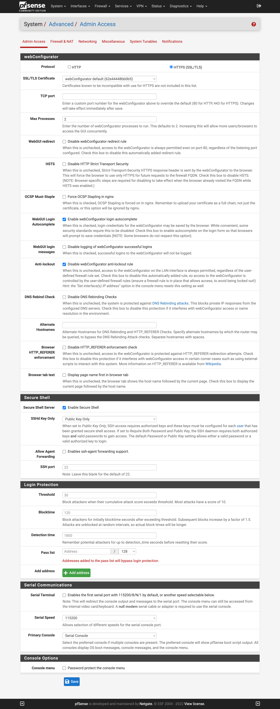

## Setup SSH Access

source: [https://docs.netgate.com/pfsense/en/latest/recipes/ssh-access.html](https://docs.netgate.com/pfsense/en/latest/recipes/ssh-access.html).  

### System>Advanced>Admin Access>Secure Shell
* Secure Shell Server: Enable Secure Shell: :white_check_mark:
* SSHd Key Only: ``Public Key Only``

### WebUI

