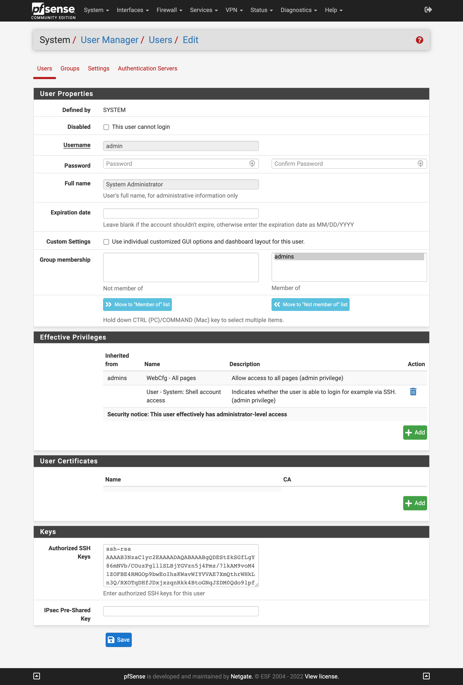

## Configure SSH User Keys

source: [https://docs.netgate.com/pfsense/en/latest/usermanager/users.html](https://docs.netgate.com/pfsense/en/latest/usermanager/users.html).  
source: [https://docs.digitalocean.com/products/droplets/how-to/add-ssh-keys/create-with-openssh/](https://docs.digitalocean.com/products/droplets/how-to/add-ssh-keys/create-with-openssh/).  

### How to generate a RSA public/private key pair

Mac or Linux: [https://www.digitalocean.com/docs/droplets/how-to/add-ssh-keys/create-with-openssh/](https://www.digitalocean.com/docs/droplets/how-to/add-ssh-keys/create-with-openssh/).  
Windows: [https://www.digitalocean.com/docs/droplets/how-to/add-ssh-keys/create-with-putty/](https://www.digitalocean.com/docs/droplets/how-to/add-ssh-keys/create-with-putty/).  

### System>User Manager>Users>Users>Keys
* Authorized SSH Keys: ``[RSA Public Key]``

### WebUI

