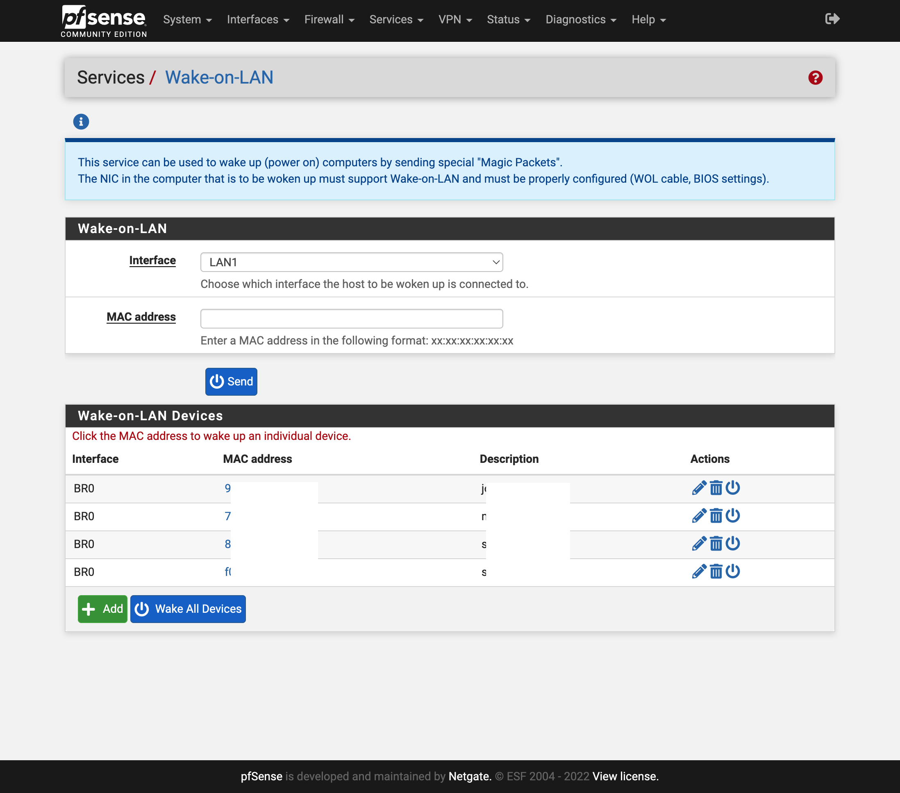

## Setup Wake on LAN

source: [https://docs.netgate.com/pfsense/en/latest/services/wake-on-lan.html](https://docs.netgate.com/pfsense/en/latest/services/wake-on-lan.html).  

### Services>Wake-on->Wake-on-LAN Devices
* Interface: ``BR0``
* MAC adddress: ``xx:xx:xx:xx:xx:xx``

Repeat for all WOL devices.  

### WebUI

