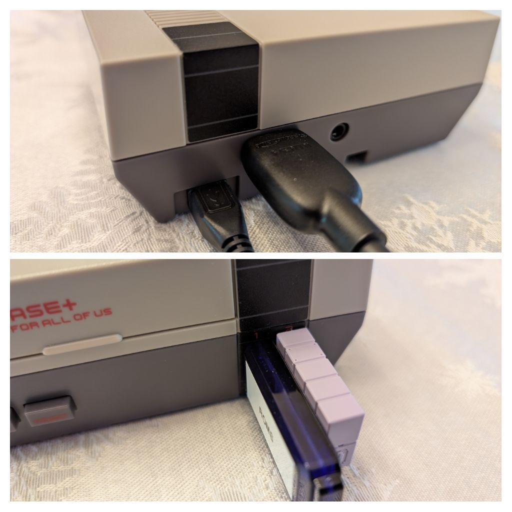
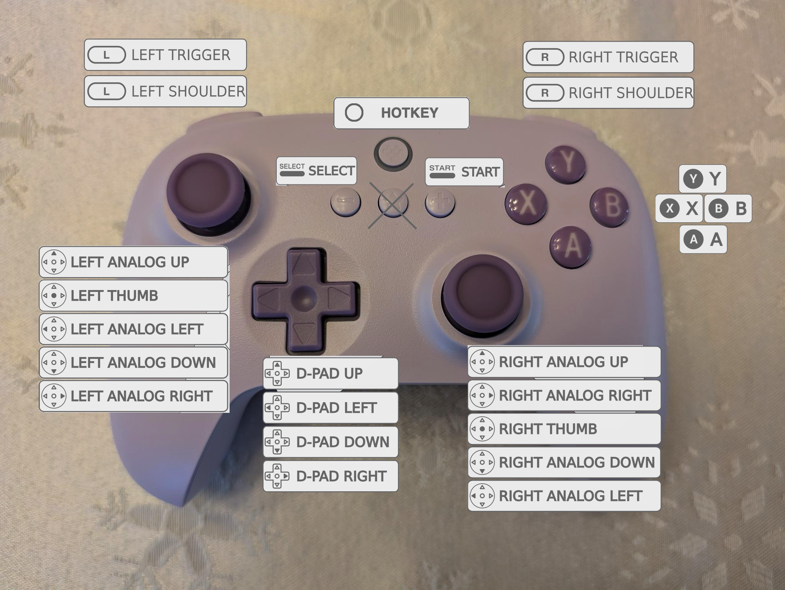

# RetroPie User's Guide

## Important

* Always power the RetroPie on and off with the **POWER BUTTON**. It is configured to cleanly shutdown the system via the power button. You need to give it a few seconds shutdown and power itself off. You may corrupt the system if you just pull the power or do not wait for it to power off gracefully.
* To exit a game you are playing and return to the RetroPie UI, press the HOTKEY button and START button at the same time. You may want to save your current game and return to the games's main menu (if applicable) prior to exiting to the RetroPie UI. See controller buttom mapping below.
* There are over 20K games on this device, I have put the top 10 games from the 8 most popular consoles in **FAVORITES** to get you started.
* **DO NOT** run the scrapper (to get metadata and artwork). Artwork and metadata have already been stored on the USB ROMS drive. If you run the scrapper, you will override the existing artwork and metadata and it may begin to fill up the internal SD card that is dedicated for the operating system.
* If you lose audio, shut the system down and reseat the hdmi cable. Go into the RetroPie menu option and scroll up and down until you hear the menu sound effects again. Also try rebooting your TV until audio is coming across the hdmi cable.
* Each different gaming console emulator has different controller mappings. See the links below to help understand what buttons do what of reach console emulator.
* I have only included the top 10 Playstation games since there are over 1600 discs that take up more than 400GB of space. If you desperately need any or all titles reach out to me and we can solve that problem (you can provide me a bigger more expensive USB flash drive).
* The system is a Raspberry Pi 3B which means it can only emulate certain consoles. Playstation and N64 sometimes push its limits. Raspberry Pi 4 or 5s can emulate even more consoles. Here is the [blueprint](https://github.com/seanwo/how-to/blob/master/retropie/retropie.md) I used to build this system that can be used as a starting point for building one on a Pi 4/5/beyond.

## Quick Setup

Plug the things in and press the power button the console...

## Controller Button Mapping

Press and hold the "hotkey"/power button the controller until it vibrates and connects to the console...

## Console Specific Details

If you need help or need to see button mappings on a specific console emulator reference these links:

* [amstradcpc](https://retropie.org.uk/docs/Amstrad-CPC/)
* [atari2600](https://retropie.org.uk/docs/Atari-2600/)
* [atari5200](https://retropie.org.uk/docs/Atari-800-and-5200/)
* [atari7800](https://retropie.org.uk/docs/Atari-7800/)
* [atarilynx](https://retropie.org.uk/docs/Atari-Lynx/)
* [channelf](https://retropie.org.uk/docs/Fairchild-ChannelF/)
* [coleco](https://retropie.org.uk/docs/Colecovision/)
* [fds](https://retropie.org.uk/docs/Famicom-Disk-System/)
* [gamegear](https://retropie.org.uk/docs/Game-Gear/)
* [gb](https://retropie.org.uk/docs/Game-Boy/)
* [gba](https://retropie.org.uk/docs/Game-Boy-Advance/)
* [gbc](https://retropie.org.uk/docs/Game-Boy-Color/)
* [mastersystem](https://retropie.org.uk/docs/Master-System/)
* [megadrive](https://retropie.org.uk/docs/Mega-Drive-Genesis/)
* [n64](https://retropie.org.uk/docs/Nintendo-64/)
* [nes](https://retropie.org.uk/docs/Nintendo-Entertainment-System/)
* [ngp](https://retropie.org.uk/docs/Neo-Geo-Pocket/)
* [ngpc](https://retropie.org.uk/docs/Neo-Geo-Pocket-Color/)
* [pcengine](https://retropie.org.uk/docs/PC-Engine/)
* [psx](https://retropie.org.uk/docs/Playstation-1/)
* [sega32x](https://retropie.org.uk/docs/Sega-32X/)
* [segacd](https://retropie.org.uk/docs/Sega-CD/)
* [sg-1000](https://retropie.org.uk/docs/SG-1000/)
* [snes](https://retropie.org.uk/docs/Super-Nintendo-Entertainment-System/)
* [vectrex](https://retropie.org.uk/docs/Vectrex/)
* [zxspectrum](https://retropie.org.uk/docs/ZX-Spectrum/)
