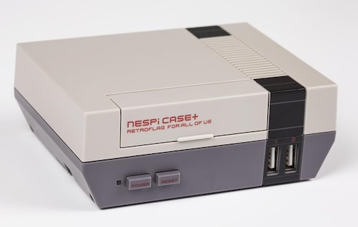

# RetroPie Instructions



## Parts List
  
* [Raspberry Pi 3 - Model B](https://www.raspberrypi.com/products/raspberry-pi-3-model-b/) $35
* [Retroflag NESPi Case Plus](https://www.amazon.com/dp/B07BRHDVTN) $20
* [8Bitdo Ultimate C 2.4g Wireless Controller](https://www.amazon.com/dp/B0C2V6JLNJ) $20
* [Micro Center SuperSpeed 5 Pack 64GB USB 3.0 Flash Drive](https://www.amazon.com/gp/product/B07T4J6X1N/) $5 (per drive)
* [PNY P-SDU32GX5U1100EL-MP 32GB Elite Class 10 U1 microSDHC Flash Memory Card](https://www.amazon.com/PNY-Elite-microSDHC-Memory-5-Pack/dp/B09WW69YRD) $4 (per card)
* [GeeKPi Fan for Raspberry Pi, 0x30x7mm DC 5V with 7PCS Heatsink (4-Pack)](https://www.amazon.com/gp/product/B07PHGTJKK/) $3 (per fan)

## Steps

### Preparing the Hardware

Install the Raspberry Pi into the NESPI case: https://retroflag.com/download/NESPi_CASE+_Manual.pdf</br>
**Note**: *Make sure you set the SAFE SHUTDOWN switch to ON.*

### Preparing the OS

On your PC, get the Raspberry Pi Imager from https://www.raspberrypi.com/software/</br>
</br>
Select the following options in the Raspberry Pi Imager and flash the microSD card.
* Raspberry Pi Device: Raspberry Pi 3
* Operating System: Emulation and Games OS -> RetroPie -> RetroPie 4.8 (RPI 2/3/Zero 2 W) (or latest version)
* Storage: Your microSD card (be careful and choose the correct card since will wipe all data on the device)

After the card has been flashed, insert it into the Raspberry Pi.

### Initial Raspberry Pi Setup

Power up the system connected to an HDMI display.</br>
You will be prompted to configure your input device.</br>
If you have a keyboard, I suggest you configure that first.</br>
To configure subsequent devices (such as your first controller), you can always press the "start" key/button and select "configure input".</br>
</br>
Now, navigate to the RetroPie Main Menu and select "RASPI-CONFIG" and set the following options:
* System Options: hostname: [hostname] (default is: retropie)
* System Options: password: [password] (default is: raspberry)
* Localization Options: timezone: country: [timezone]
* Localization Options: WLAN country: [country]
* Interface Options: enable ssh (default is: disabled)

Exit, raspi-config, select the "start" key/button, and select quit -> restart system.

### Configure Safe Shutdown

SSH into the raspberry pi:
```console
ssh pi@retropie
```
run the following command:
```console
wget -O - "https://raw.githubusercontent.com/RetroFlag/retroflag-picase/master/install.sh" | sudo bash
```
Now, test that the button on the front of the NESPi case gracefully shuts down the system.

### Update the System

Navigate to the RetroPie Main Menu and select "RETROPIE SETUP" and select update.</br>
Say yes to all prompts including updating the OS.</br>
This will take a long time.  Once it is complete, reboot the pi.

### Setup USB drive or External SSD for Games (optional)

source: https://retropie.org.uk/docs/Running-ROMs-from-a-USB-drive/<br>

Basically, format your SSD as exFat, place folder on it called "retropie-mount", boot your raspberry pi up with the drive plugged in, wait for the drive to stop flashing and it will be initialized for games.

### RetroPie Packages

RetroPi has the following packages it uses: core, main, opt (optional) and exp (experimental). Core packages are basically the RetroPi UI and drivers. Main packages are the emulators it installs by default. Optional packages are alternative emulators to the ones in the main packages and/or extra emulators you can install.  Experimental packages extend the optional packages but are less likely to be stable.</br>
</br>
Each emulator can be a snowflake on what is needed to get ROMs (games) running on them.  The next section covers my adventures and choices for running ROMS and ports on selected emulators.  Your decisions may vary.

### Emulators

In the package manager, remove the following main (arcade) packages:

* lr-fbneo
* lr-mame2003

Add the following optional & experimental (replacment) packages:

* coolcv (optiona)
* lr-freechaf (experimental)

Here are the notes for configuring the packages, getting roms, and BIOS files:

| directory | rp_module_id | roms | bios | bios.name | bios.source | setup notes |
| --------- | ------------ | ---- | ---- | --------- | ----------- | ----------- |
| amstradcpc | lr-caprice32 | https://archive.org/download/hearto-1g1r-collection/hearto_1g1r_collection/Amstrad%20-%20CPC.zip | none |  |  | use start+Y for virtual keyboard |
| atari2600 | lr-stella2014 | https://archive.org/download/hearto-1g1r-collection/hearto_1g1r_collection/Atari%20-%202600.zip | none |  |  |  |
| atari5200 | lr-atari800 | https://archive.org/download/hearto-1g1r-collection/hearto_1g1r_collection/Atari%20-%205200.zip | required | 5200.rom | [BIOS] Atari 5200 (USA).zip | https://youtu.be/u2nj73mNgAE?si=-mP15IKaJIe7Dvoj</br>https://youtu.be/D8eZDq3xyBA?si=ZA8AogZAAm8ot4LU |
| atari7800 | lr-prosystem | https://archive.org/download/hearto-1g1r-collection/hearto_1g1r_collection/Atari%20-%207800.zip | optional | 7800 BIOS (U).rom | [BIOS] Atari 7800 (USA).zip |  |
| atarilynx | lr-handy | https://archive.org/download/hearto-1g1r-collection/hearto_1g1r_collection/Atari%20-%20Lynx.zip | optional | lynxboot.img | [BIOS] Atari Lynx (USA, Europe).zip |  |
| channelf | lr-freechaf | https://archive.org/download/hearto-1g1r-collection/hearto_1g1r_collection/Fairchild%20-%20Channel%20F.zip | required | sl31253.bin</br>sl31254.bin</br>sl90025.bin | [BIOS] Fairchild Channel F (USA) (SL31253).zip</br>[BIOS] Fairchild Channel F (USA) (SL31254).zip</br>[BIOS] Fairchild Channel F (USA) (SL90025).zip |  |
| coleco | coolcv | https://archive.org/download/hearto-1g1r-collection/hearto_1g1r_collection/Coleco%20-%20ColecoVision.zip | none |  |  | requires real keyboard |
| fds | lr-nestopia | https://archive.org/download/hearto-1g1r-collection/hearto_1g1r_collection/Nintendo%20-%20Nintendo%20Entertainment%20System.zip | required | disksys.rom | [BIOS] Family Computer Disk System (Japan) (Rev 1).zip |  |
| gamegear | lr-genesis-plus-gx | https://archive.org/download/hearto-1g1r-collection/hearto_1g1r_collection/Sega%20-%20Game%20Gear.zip | optional | bios.gg | [BIOS] Sega Game Gear (USA) (Majesco).zip |  |
| gb | lr-gambatte | https://archive.org/download/hearto-1g1r-collection/hearto_1g1r_collection/Nintendo%20-%20Game%20Boy.zip | optional | gb_bios.bin | [BIOS] Nintendo Game Boy Boot ROM (World) (Rev 1).zip |  |
| gba | lr-mgba | https://archive.org/download/hearto-1g1r-collection/hearto_1g1r_collection/Nintendo%20-%20Game%20Boy%20Advance.zip | optional | gba_bios.bin | [BIOS] Game Boy Advance (World).zip |  |
| gbc | lr-gambatte | https://archive.org/download/hearto-1g1r-collection/hearto_1g1r_collection/Nintendo%20-%20Game%20Boy%20Color.zip | optional | gbc_bios.bin | [BIOS] Nintendo Game Boy Color Boot ROM (World) (Rev 1).zip |  |
| mastersystem | lr-genesis-plus-gx | https://archive.org/download/hearto-1g1r-collection/hearto_1g1r_collection/Sega%20-%20Master%20System%20-%20Mark%20III.zip | optional | bios_E.sms</br>bios_J.sms</br>bios_U.sms | [BIOS] Sega Master System (USA, Europe) (v1.3).zip</br>[BIOS] Sega Master System (Japan) (v2.1).zip</br>[BIOS] Sega Master System (USA, Europe) (v1.3).zip |  |
| megadrive | lr-genesis-plus-gx | https://archive.org/download/hearto-1g1r-collection/hearto_1g1r_collection/Sega%20-%20Mega%20Drive%20-%20Genesis.zip | optional | bios_MD.bin | [BIOS] Sega Mega Drive - Genesis Boot ROM (World).zip |  |
| n64 | mupen64plus | https://archive.org/download/hearto-1g1r-collection/hearto_1g1r_collection/Nintendo%20-%20Nintendo%2064.zip | none |  |  | uncompress all .zip files to .z64 |
| nes | lr-fceumm | https://archive.org/download/hearto-1g1r-collection/hearto_1g1r_collection/Nintendo%20-%20Nintendo%20Entertainment%20System.zip | optional |  |  | no roms needed for nes; only fds |
| ngp | lr-beetle-ngp | https://archive.org/download/hearto-1g1r-collection/hearto_1g1r_collection/SNK%20-%20Neo%20Geo%20Pocket.zip | none |  |  |  |
| ngpc | lr-beetle-ngp | https://archive.org/download/hearto-1g1r-collection/hearto_1g1r_collection/SNK%20-%20Neo%20Geo%20Pocket%20Color.zip | none |  |  |  |
| pcengine | lr-beetle-supergrafx | https://archive.org/download/hearto-1g1r-collection/hearto_1g1r_collection/NEC%20-%20PC%20Engine%20SuperGrafx.zip | required | syscard3.pce | [BIOS] Super CD-ROM System (Japan) (v3.0).zip | make lr-beetle-supergrafx default engine |
| psx | lr-pcsx-rearmed | https://archive.org/download/chd_psx/CHD-PSX-USA/ | required | psxonpsp660.bin & scph101.bin & scph7001.bin & scph5501.bin & scph1001.bin | https://github.com/Abdess/retroarch_system/tree/libretro/Sony%20-%20PlayStation | |
| sega32x | lr-picodrive | https://archive.org/download/hearto-1g1r-collection/hearto_1g1r_collection/Sega%20-%2032X.zip | none |  |  |  |
| segacd | lr-genesis-plus-gx | no games; add on periphal | required | bios_CD_U.bin</br>bios_CD_E.bin</br>bios_CD_J.bin | [BIOS] Sega CD (USA) (Rev B).zip</br>[BIOS] Mega-CD (Europe).zip</br>[BIOS] Mega-CD (Asia) (Ja) (Rev H).zip |  |
| sg-1000 | lr-genesis-plus-gx | https://archive.org/download/hearto-1g1r-collection/hearto_1g1r_collection/Sega%20-%20SG-1000.zip | none |  |  |  |
| snes | lr-snes9x2010 | https://archive.org/download/hearto-1g1r-collection/hearto_1g1r_collection/Nintendo%20-%20Super%20Nintendo%20Entertainment%20System.zip | required (satellaview) | BS-X.bin | https://archive.org/download/bsx-bios | uncompress satellaview from .zip to .bs |
| vectrex | lr-vecx | https://archive.org/download/hearto-1g1r-collection/hearto_1g1r_collection/GCE%20-%20Vectrex.zip | none |  |  |  |
| zxspectrum | lr-fuse | https://myrient.erista.me/files/TOSEC/Sinclair/ZX%20Spectrum/Games/%5BZ80%5D/Sinclair%20ZX%20Spectrum%20-%20Games%20-%20%5BZ80%5D.zip | none |  |  | select for virtual keyboard; hotkey-x to configure kempston joystick

### Scraping

Metadata and box art is achieved through scraping. RetroPie has a scraper built in but it will store the metadata (gamelist.xml) and images on the SD card instead of on the USB drive if you have your games stored on an external device. To overcome this we will need to install the actual command line [scraper](https://github.com/sselph/scraper/wiki) and run it on each rom directory individually.</br>
</br>
First, go to [ScreenScaper](https://screenscraper.fr/index.php) and create an account with a username and password.</br>
</br>
Second, in the package manager, install the scaper supplemental package.</br>
</br>
Lastly, run the scraper on each system's roms.</br>

SSH into the raspberry pi:
```console
ssh pi@retropie
```

run the following command:
```console
cd Retro/roms/[systemname]
/opt/retropie/supplementary/scraper/scraper -console_src ss -ss_user=username -ss_password password -missing missing.txt
```

Repeat the above command for each system.</br>

Alternately, if you want to use the built in scraper, you will need to download the images and them move them to the external storage. This is an example of doing that for the psx console:

```console
cp /home/pi/.emulationstation/gamelists/psx/gamelist.xml /home/pi/.emulationstation/gamelists/psx/gamelist.xml.bak
```

Run scrapper on psx console only via the UI

```console
mkdir /home/pi/RetroPie/roms/psx/images
cp /home/pi/.emulationstation/gamelists/psx/gameslist.xml /home/pi/RetroPie/roms/psx
cd /home/pi/RetroPie/roms/psx/images
cp /home/pi/.emulationstation/downloaded_images/psx/* .
rm -rf /home/pi/.emulationstation/downloaded_images/psx
rm /home/pi/.emulationstation/gamelists/psx/gameslist.xml
mv /home/pi/.emulationstation/gamelists/psx/gameslist.xml.bak /home/pi/.emulationstation/gamelists/psx/gameslist.xml
```

Now, update all image references in the /home/pi/RetroPie/roms/psx/gameslist.xml to point to the external storage directory you moved them to.</br>

Add the top 10 games for each major console to the favorites collection:

#### Atari 2600

1. Pac-Man
2. Space Invaders
3. Donkey Kong
4. Pitfall!
5. Frogger
6. Asteroids
7. Defender
8. E.T. the Extra-Terrestrial
9. Ms. Pac-Man
10. Demon Attack

#### GB/GBC

1. Pokémon Red / Green / Blue / Yellow
2. Tetris
3. Pokémon Gold / Silver / Crystal
4. Super Mario Land
5. Super Mario Land 2: 6 Golden Coins
6. Dr. Mario
7. Pokémon Pinball
8. Wario Land: Super Mario Land 3
9. Kirby's Dream Land
10. Super Mario Bros. Deluxe

#### GBA

1. Pokémon Ruby and Sapphire
2. Pokémon FireRed and LeafGreen
3. Pokémon Emerald
4. Mario Kart: Super Circuit
5. Super Mario World: Super Mario Advance 2
6. Super Mario Advance
7. Super Mario Advance 4: Super Mario Bros. 3
8. Namco Museum
9. Pac-Man Collection
10. Yoshi's Island: Super Mario Advance 3

#### MegaDrive

1. Sonic the Hedgehog
2. Sonic the Hedgehog 2
3. Mortal Kombat
4. Disney's Aladdin
5. Sonic the Hedgehog 3 Sonic & Knuckles
6. Jurassic Park
7. NBA Jam
8. Mortal Kombat II
9. Street Fighter II': Special Champion Edition
10. Eternal Champions

#### N64

1. Super Mario 64
2. Mario Kart 64
3. GoldenEye 007
4. The Legend of Zelda: Ocarina of Time
5. Super Smash Bros.
6. Pokémon Stadium
7. Donkey Kong 64
8. Diddy Kong Racing
9. Star Fox 64
10. Banjo-Kazooie

#### NES

1. Super Mario Bros.
2. Duck Hunt
3. Super Mario Bros. 3
4. Tetris
5. Super Mario Bros. 2 (international version)
6. The Legend of Zelda
7. Dr. Mario
8. Zelda II: The Adventure of Link
9. Excitebike
10. Golf

#### PSX

1. Gran Turismo
2. Final Fantasy VII
3. Gran Turismo 2
4. Final Fantasy VIII
5. Tekken 3
6. Harry Potter and the Philosopher's Stone
7. Crash Bandicoot 2: Cortex Strikes Back
8. Crash Bandicoot: Warped
9. Tomb Raider
10. Metal Gear Solid

#### SNES

1. Super Mario World
2. Super Mario All-Stars
3. Donkey Kong Country
4. Super Mario Kart
5. Street Fighter II: The World Warrior
6. Donkey Kong Country 2: Diddy's Kong Quest
7. The Legend of Zelda: A Link to the Past
8. Super Mario World 2: Yoshi's Island
9. Street Fighter II Turbo
10. Star Fox
