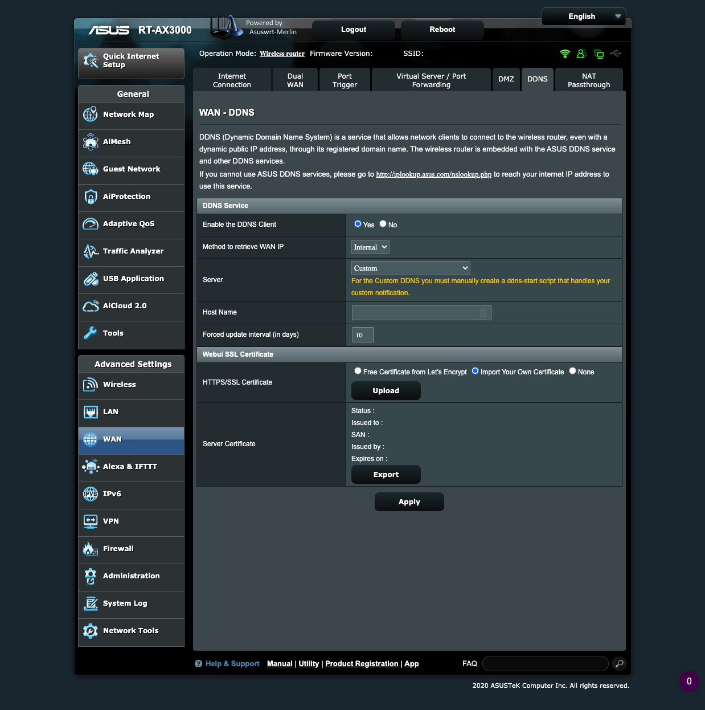

## DDNS

### How do you configure a custom DDNS in Asuswrt-Merlin?

https://github.com/RMerl/asuswrt-merlin.ng/wiki/Custom-DDNS

**WAN -> DDNS -> DDNS Service**

```
Enable the DDNS Client: Yes
Method to retrieve WAN IP: Internal
Server: Custom
Host Name: [your custom hostname from your DDNS provider; see below]
Forced update interval (in days): 10
```

**Administration -> System -> Persistent JFFS2 Partition**

```
Enable JFFS custom scripts and configs: Yes
```

You will need to create a custom script: https://github.com/RMerl/asuswrt-merlin.ng/wiki/DDNS-Sample-Scripts  

#### Afraid.org

I use a subdomain from DDNS service provider https://afraid.org.  Create a subdomain there if you decided to use them as your DDNS provider.

Here is a sample afraid.org script you can use: https://github.com/RMerl/asuswrt-merlin.ng/wiki/DDNS-Sample-Scripts#afraidorg  

To put the script on your router:  

SSH into your router

```console
ssh -i id_rsa_router admin@192.168.0.1
```

 and then use an editor (vi) to create the custom script /jffs/scripts/ddns-start

make sure the script has execute permissions and contains *your* afraid.org update key

```console
chgrp admin:root /jffs/scripts/ddns-start
chmod 777 /jffs/scripts/ddns-start
```

To test that it is working, set your ip address on afraid.org to 127.0.0.1 and then reboot the router.  
If it worked, your afraid.org subdomain will resolve to your public facing ip address.  

Check that is matches the ip address shown when you go to https://whatismyipaddress.com/

### WebUI


