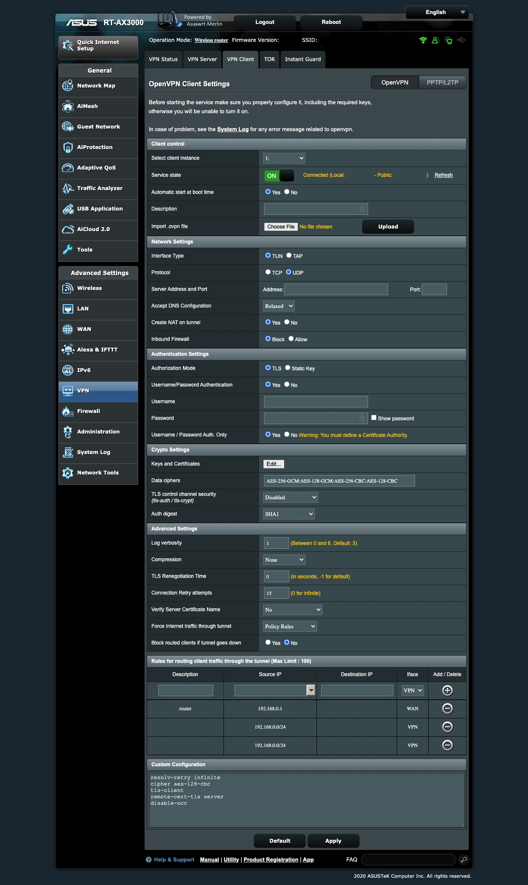

## VPN Client Policy Routing

The IP address assigned to your router by your ISP will usually reveal your approximate location.

https://iplocation.com/

Perhaps you need certain traffic to appear as though it is coming from another geography by using a remote VPN service provider?

Using the client VPN on your router, you can route some or all traffic through that VPN. By default, all traffic is routed through the VPN.  However, policy rules can be used to selectively route traffic destined for certain ip or CIDR blocks.

Asuswrt-Merlin client VPNs support policy based routing: https://github.com/RMerl/asuswrt-merlin.ng/wiki/Policy-based-routing

### Identify destination IP addresses for your VPN traffic

Isolate the domain name of the service you want to connect to through your VPN (using google, network sniffing, etc.) and then do an nslookup on the domain.

Example:
https://www.nslookup.io/dns-records/api.locastnet.org

Write down the IP addresses from the nslookup to use with your policy rules.

Example:

```
10.10.10.5
10.11.11.6
```

**Warning:** IP addresses can change so you will need to update the policy if the ip addresses for a DNS record change or use the scripted method below.

### Setup your router's client VPN

If your VPN service provider provides .ovpn file then get one for the geography you want to connect to.

Example: https://www.privateinternetaccess.com/helpdesk/kb/articles/where-can-i-find-your-ovpn-files-2

**VPN -> VPN Client -> Client Control**

```
Import .ovpn file: Choose File and then press upload.
```

Your client will auto-configure.  If not, manually configure the client for your VPN provider.

**VPN -> VPN Client -> Client Control**

```
Automatic start at boot time: Yes
Description: [call it what you want]
```

### Setup your router's VPN client policy rules

**VPN -> VPN Client -> Advanced Settings**

```
Force internet traffic through tunnel: Policy Rules
```

**VPN -> VPN Client -> Rules for routing traffic through the tunnel**

```
Description: router
Source IP: 192.168.0.1
Destination IP: 
Iface: WAN
```

```
Description: service1
Source IP: 192.168.0.0/24
Destination IP: [ip 1 from nslookup]
Iface: VPN
```
...
```
Description: serviceN
Source IP: 192.168.0.0/24
Destination IP: [ip N from nslookup]
Iface: VPN
```

Apply the settings

**VPN -> VPN Client -> Client Control**

```
Service state: ON
```

Now any traffic from your subnet destined for the ip addresses you added will travel through the client VPN and show the location of the VPN server during geolocation lookups.

### Automate DNS IP Changes

Since the IP addresses for any DNS can change, you will want to monitor and then update the policy rules when they change.

This can be scripted and then set to run on as a scheduled job.

Here is an example script [client1update](client1update.sh) that does this for VPN client #1.

Place your script file in /jffs/scripts and make it executable.

```console
vi /jffs/scripts/client1update
chmod + x /jffs/scripts/client1update
```

Test that your script does what it is supposed to do by changing the client policy rules in the WebUI and then running this script to correct them.

If that works, set a scheduled job to run the script every 5 minutes:

source: https://www.cyberciti.biz/faq/how-to-add-cron-job-on-asuswrt-merlin-wifi-router/

```console
cru a client1update "*/5 * * * * /jffs/scripts/client1update"
```

If you want your scheduled job to survive across router reboots, add the previous command to a file called /jffs/scripts/services-start

```console
vi /jffs/scripts/services-start
chmod +x /jffs/scripts/services-start
```

Reboot the router and make sure the schedule job is set to run.

```console
cru l
```

### WebUI:


