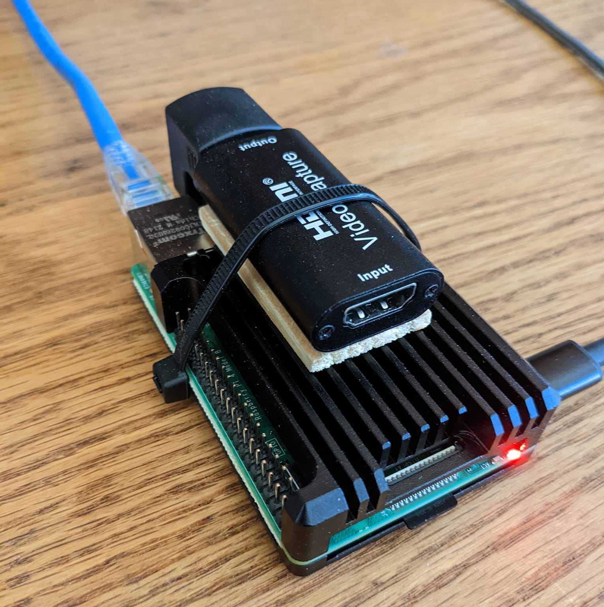

## TinyPilot KVM Over IP Switch 

source: https://tinypilotkvm.com/blog/build-a-kvm-over-ip-under-100#how-to-build-your-own-tinypilot  
source: https://www.geekyhacker.com/2021/02/15/configure-ssh-key-based-authentication-on-raspberry-pi/  
source: https://pimylifeup.com/raspberry-pi-update/  



Parts List:  
* [Raspberry Pi 4 2GB](https://www.ebay.com/sch/i.html?_from=R40&_trksid=p2380057.m570.l1313&_nkw=raspberry+pi+4+2gb&_sacat=0) ~$100
* [SanDisk 16GB Ultra microSDHC UHS-I Memory Card](https://www.amazon.com/Sandisk-Ultra-Micro-UHS-I-Adapter/dp/B073K14CVB) (or any class 10 card you have lying around). $10
* [Raspberry Pi 4 B Heavy Metal Case](https://www.amazon.com/dp/B07TVS5GWV) (or other case to your liking). $11
* [4K HDMI Video Capture Card](https://www.amazon.com/dp/B09FLN63B3) $17
* [Amazon Basics USB Type-C to USB-A Male 3.1 Gen2 Adapter Charger Cable - 3 Feet (0.9 Meters) - Black](https://www.amazon.com/dp/B01GGKYR2O) $14
* [USB Type A to Type A Adapter Up & Down Angled USB 3.0 Adapter A Male to Female Extension 180 Degree 5Gbps](https://www.amazon.com/dp/B08QR95QB8) (optional) $10

Goto https://www.raspberrypi.com/software/ and get the imager tool or use brew to install it.

```console
brew install raspberry-pi-imager
```

Run the tool and select:  
Operating System: Raspberry Pi OS (other) -> Raspberry Pi OS Lite (32-bit). 
* Storage: Select your microSD card. 
* Settings:  
   * Set hostname: tinypilot. 
   * Enable SSH: Use password authentication. 
   * Set username and password: tinypilot/[secure password]. 
   * Set lcoale settings: Time zone: [your time zone]. 
* Select Write to image the card.  

Put the card in the raspberry pi and boot it up on the network.  
Check your router for the ip address that it aquired.  Optionally assign the mac address to a reserved dhcp ip address and cname it to tinypilot.  

Update the OS and packages:  

```console 
ssh tinypilot@tinypilot
```

```console
sudo apt update
sudo apt full-upgrade
sudo reboot
```
Update the bootloader

```console 
ssh tinypilot@tinypilot
```

Check if the bootloader is up-to-date:  
```console
sudo rpi-eeprom-update
```

If the bootloader is not up-to-date:  
```console
sudo rpi-eeprom-update -a
sudo reboot
```

Generate an RSA keypair (id_rsa_tinypilot & id_rsa_tinypilot.pub) on the client

```console
ssh-keygen -t rsa -C "tinypilot@tinypilot"
```

and then copy the public key to the device:  

```console
ssh-copy-id -i ~/.ssh/id_rsa_tinypilot.pub tinypilot@tinypilot
```

Remove the ablity login with a password (only using rsa private key):  

```console
sudo vim /etc/ssh/sshd_config
```

Change the following parameters in the file:  
```
PermitRootLogin no
PasswordAuthentication no
ChallengeResponseAuthentication no
UsePAM no
```

```console
sudo systemctl reload sshd
```

Confirm that you can only ssh with the rsa private key and not passwords.  To login with the rsa private key use this command from the client:  
```console
ssh -i ~./ssh/id_rsa_tinypilot tinypilot@tinypilot
```

Install TinyPilot software:  
 
```console
curl -sS https://raw.githubusercontent.com/tiny-pilot/tinypilot/master/quick-install | bash -
sudo reboot
```

Access your new TinyPilot KVM at http://tinypilot (or http://[hostname] where hostname is the hostname you assigned the device and added to your router) (or http://192.168.0.xxx where the ip address is the address of your TinyPilot)
