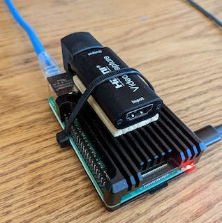

## Raspberry Pi Management Server

source: https://tinypilotkvm.com/blog/build-a-kvm-over-ip-under-100#how-to-build-your-own-tinypilot  
source: https://www.geekyhacker.com/2021/02/15/configure-ssh-key-based-authentication-on-raspberry-pi/  
source: https://pimylifeup.com/raspberry-pi-update/  
source: https://community.ui.com/questions/Step-By-Step-Tutorial-Guide-Raspberry-Pi-with-UniFi-Controller-and-Pi-hole-from-scratch-headless/e8a24143-bfb8-4a61-973d-0b55320101dc  



### Parts Needed

Parts List:  
* [Raspberry Pi 4 2GB](https://www.ebay.com/sch/i.html?_from=R40&_trksid=p2380057.m570.l1313&_nkw=raspberry+pi+4+2gb&_sacat=0) ~$100
* [SanDisk 16GB Ultra microSDHC UHS-I Memory Card](https://www.amazon.com/Sandisk-Ultra-Micro-UHS-I-Adapter/dp/B073K14CVB) (or any class 10 card you have lying around). $10
* [Raspberry Pi 4 B Heavy Metal Case](https://www.amazon.com/dp/B07TVS5GWV) (or other case to your liking). $11
* [4K HDMI Video Capture Card](https://www.amazon.com/dp/B09FLN63B3) $17
* [Amazon Basics USB Type-C to USB-A Male 3.1 Gen2 Adapter Charger Cable - 3 Feet (0.9 Meters) - Black](https://www.amazon.com/dp/B01GGKYR2O) $14
* [USB Type A to Type A Adapter Up & Down Angled USB 3.0 Adapter A Male to Female Extension 180 Degree 5Gbps](https://www.amazon.com/dp/B08QR95QB8) (optional) $10

### Software Manifest
* [Base OS](#install-the-base-os)
* [TinyPilot KVM](#install-tinypilot-kvm-software)
* [Ubiquiti Unifi Controller](#install-ubiquiti-unifi-controller)
* [Install Network UPS Tools](#install-network-ups-tools)

### Install the Base OS

Goto https://www.raspberrypi.com/software/ and get the imager tool or use brew to install it.

```console
brew install raspberry-pi-imager
```

Run the tool and select:  
Operating System: Raspberry Pi OS (other) -> Raspberry Pi OS Lite (32-bit). 
* Storage: Select your microSD card. 
* Settings:  
   * Set hostname: tinypilot. 
   * Enable SSH: Use password authentication. 
   * Set username and password: tinypilot/[secure password]. 
   * Set lcoale settings: Time zone: [your time zone]. 
* Select Write to image the card.  

Put the card in the raspberry pi and boot it up on the network.  
Check your router for the ip address that it aquired.  Optionally assign the mac address to a reserved dhcp ip address and cname it to tinypilot.  

### Update the OS and packages

```console 
ssh tinypilot@tinypilot
```

```console
sudo apt update
sudo apt full-upgrade
sudo reboot
```
Update the bootloader

```console 
ssh tinypilot@tinypilot
```

Check if the bootloader is up-to-date:  
```console
sudo rpi-eeprom-update
```

If the bootloader is not up-to-date:  
```console
sudo rpi-eeprom-update -a
sudo reboot
```

### Setup SSH Keypair Only Login

Generate an RSA keypair (id_rsa_tinypilot & id_rsa_tinypilot.pub) on the client

```console
ssh-keygen -t rsa -C "tinypilot@tinypilot"
```

and then copy the public key to the device:  

```console
ssh-copy-id -i ~/.ssh/id_rsa_tinypilot.pub tinypilot@tinypilot
```

Remove the ablity login with a password (only using rsa private key):  

```console
sudo vim /etc/ssh/sshd_config
```

Change the following parameters in the file:  
```
PermitRootLogin no
PasswordAuthentication no
ChallengeResponseAuthentication no
UsePAM no
```

```console
sudo systemctl reload sshd
```

Confirm that you can only ssh with the rsa private key and not passwords.  To login with the rsa private key use this command from the client:  
```console
ssh -i ~./ssh/id_rsa_tinypilot tinypilot@tinypilot
```

### Install TinyPilot KVM Software
 
```console
curl -sS https://raw.githubusercontent.com/tiny-pilot/tinypilot/master/quick-install | bash -
sudo reboot
```

Access your new TinyPilot KVM at http://tinypilot (or http://[hostname] where hostname is the hostname you assigned the device and added to your router) (or http://192.168.0.xxx where the ip address is the address of your TinyPilot)

### Install Ubiquiti Unifi Controller

To install a Ubiquiti Unifi Controller apply and run this script:

[install-unifi.sh](install-unifi.sh)

Then access the controller at [https://tinypilot:8443/manage/account/login](https://tinypilot:8443/manage/account/login).

### Install Network UPS Tools

```console
sudo apt install nut nut-client nut-server
```

Run the scanner to find your UPS

```console
sudo nut-scanner -U
```

You should see something similar to:

```
Scanning USB bus.
[nutdev1]
	driver = "usbhid-ups"
	port = "auto"
	vendorid = "051D"
	productid = "0002"
	product = "Back-UPS XS 1300 LCD FW:836.H7 .D USB FW:H7"
	serial = "000000000000"
	vendor = "American Power Conversion"
	bus = "001"
```

Make a backup of the original configuraiton files

```console
cd /etc/nut
sudo cp nut.conf nut.example.conf
sudo cp upsd.conf upsd.example.conf
sudo cp upsd.users upsd.example.users
sudo cp ups.conf ups.example.conf
sudo cp upsmon.conf uspmon.example.conf
```

Edit ups.conf

```console
sudo vi /etc/nut/ups.conf
```

```
maxretry = 3

[apc-server]
	driver = "usbhid-ups"
	port = "auto"
	desc = "Back-UPS XS 1300 LCD"
	vendorid = "051D"
	productid = "0002"
	serial = "000000000000"
	ignorelb
	override.battery.charge.low = 15
```
NOTE: ```ignorelb``` and ```override.battery.charge.low``` are set to override the UPS default low charge percentage.  
NOTE: ```serial``` should be your real serial number.  

Edit upsmon.conf

```console
sudo vi /etc/nut/upsmon.conf
```

```
RUN_AS_USER root
MONITOR apc-server@localhost 1 upsmon secret master
MINSUPPLIES 1
SHUTDOWNCMD "/sbin/shutdown -h +0"
NOTIFYCMD "/sbin/upssched"
POLLFREQ 5
POLLFREQALERT 5
HOSTSYNC 15
DEADTIME 15 
#POWERDOWNFLAG /etc/killpower
NOTIFYFLAG ONLINE SYSLOG+WALL+EXEC
NOTIFYFLAG ONBATT SYSLOG+WALL+EXEC
NOTIFYFLAG LOWBATT SYSLOG+WALL+EXEC
NOTIFYFLAG COMMOK SYSLOG+WALL+EXEC
NOTIFYFLAG COMMBAD SYSLOG+WALL+EXEC
NOTIFYFLAG SHUTDOWN SYSLOG+WALL+EXEC
NOTIFYFLAG REPLBATT SYSLOG+WALL+EXEC
NOTIFYFLAG NOCOMM SYSLOG+WALL+EXEC
NOTIFYFLAG FSD SYSLOG+WALL+EXEC
RBWARNTIME 43200
NOCOMMWARNTIME 300
#Configure time for all secondary systems to shutdown properly then power off the UPS load; make sure you leave enough battery percentage for this
FINALDELAY 120
```
NOTE: set ```secret``` to an actual secret you will use later on the client.

Edit upsd.conf
```console
sudo vi /etc/nut/upsd.conf
```

```
MAXAGE 15
LISTEN 0.0.0.0 3493
```

Edit nut.conf
```console
sudo vi /etc/nut/nut.conf
```

```
MODE=netserver
```

Edit upsd.users
```console
sudo vi /etc/nut/upsd.users
```

```
[admin]
password = secret
actions = set
actions = fsd
instcmds = ALL

[monmaster]
password = secret
upsmon master
 ```
NOTE: set ```secret``` to an actual secret you used in upsmon.conf.

Edit upssched.conf
```console
sudo vi /etc/nut/upssched.conf
```

```
CMDSCRIPT /etc/nut/upssched-cmd
PIPEFN /etc/nut/upssched.pipe
LOCKFN /etc/nut/upssched.lock

AT ONLINE * EXECUTE online
AT ONBATT * EXECUTE onbatt
AT LOWBATT * EXECUTE lowbatt
AT COMMOK * EXECUTE commok
AT COMMBAD * EXECUTE commbad
AT SHUTDOWN * EXECUTE powerdown
AT REPLBATT * EXECUTE replbatt
AT NOCOMM * EXECUTE nocomm
AT FSD * EXECUTE force-shutdown
AT NOPARENT * EXECUTE noparent
```

Edit upssched-cmd
```console
sudo vi /etc/nut/upssched-cmd
```

```
#!/bin/sh
 case $1 in
       online)
          logger -t upssched-cmd "Running on line power"
          ;;
       onbatt)
          logger -t upssched-cmd "Line Power Fail, system running on battery power"
          ;;
       lowbatt)
          logger -t upssched-cmd "Low battery power"
          ;;
       commok)
          logger -t upssched-cmd "Communications with the UPS are established"
          ;;
       commbad)
          logger -t upssched-cmd "Communications with the UPS are lost"
          ;;
       powerdown)
          logger -t upssched-cmd "Automatic logout and shutdown proceeding"
          #prevents FINALDELAY from running:
          #/usr/sbin/upsmon -c fsd
          ;;
       repbatt)
          logger -t upssched-cmd "The battery needs to be replaced!"
          ;;
       nocomm)
          logger -t upssched-cmd "The battery needs to be replaced!"
          ;;
       force-shutdown)
          logger -t upssched-cmd "Forced shutdown in progress"
          #prevents FINALDELAY from running:
	  #/usr/sbin/upsmon -c fsd
          ;;
       noparent)
          logger -t upssched-cmd "upsmon parent process died - shutdown impossible"
          ;;
       *)
          logger -t upssched-cmd "Unrecognized command: $1"
          ;;
 esac
```

Make upssched-cmd executable
```console
sudo chmod +x /etc/nut/upssched-cmd
```
Restart all the nut based services

```console
sudo service nut-server restart
sudo service nut-client restart
sudo systemctl restart nut-monitor
sudo upsdrvctl stop
sudo upsdrvctl start
```

Check that the service is up and monitoring the UPS

```console
upsc apc-server@localhost
```

You should see something similar to:

```
Init SSL without certificate database
battery.charge: 100
battery.charge.low: 25
battery.charge.warning: 50
battery.date: 2030/00/38
battery.mfr.date: 2008/01/16
battery.runtime: 8724
battery.runtime.low: 120
battery.type: PbAc
battery.voltage: 27.1
battery.voltage.nominal: 24.0
device.mfr: American Power Conversion
device.model: Back-UPS XS 1300 LCD
device.serial: 8B0803R29816  
device.type: ups
driver.flag.ignorelb: enabled
driver.name: usbhid-ups
driver.parameter.pollfreq: 30
driver.parameter.pollinterval: 1
driver.parameter.port: auto
driver.parameter.productid: 0002
driver.parameter.serial: 000000000000
driver.parameter.synchronous: no
driver.parameter.vendorid: 051D
driver.version: 2.7.4
driver.version.data: APC HID 0.96
driver.version.internal: 0.41
input.sensitivity: medium
input.transfer.high: 139
input.transfer.low: 88
input.transfer.reason: input voltage out of range
input.voltage: 125.0
input.voltage.nominal: 120
ups.beeper.status: disabled
ups.delay.shutdown: 20
ups.firmware: 836.H7 .D
ups.firmware.aux: H7 
ups.load: 2
ups.mfr: American Power Conversion
ups.mfr.date: 2008/01/16
ups.model: Back-UPS XS 1300 LCD
ups.productid: 0002
ups.realpower.nominal: 780
ups.serial: 000000000000  
ups.status: OL
ups.test.result: No test initiated
ups.timer.reboot: 0
ups.timer.shutdown: -1
ups.vendorid: 051d
```
