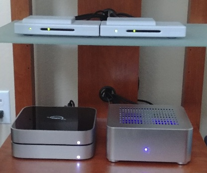

# Instructions for Building an Ubuntu Plex Media System



[My Hardware Specs](hardware.md)  
[Install Ubuntu LTS](ubuntu.md)  
[Install Chrome](chrome.md)  
[Install TeamViewer](teamviewer.md)  
[Install HDHomeRun](hdhomerun.md)  
[Install Plex Media Server](plexmediaserver.md)  
[Install qBittorrent](qbittorrent.md)  
[Install SFTP Server](sftpserver.md)  
[Install Samba](samba.md)  

## Install Apple Time Machine Samba Support

Create a Time Machine user:
```console
sudo adduser tmuser
sudo groupadd tm_users
sudo usermod -aG tm_users tmuser
sudo smbpasswd -a tmuser
```
Setup a Time Machine share point:
```console
sudo mkdir -p /var/samba/timemachine
sudo chown root:tm_users /var/samba/timemachine
sudo chmod 775 /var/samba/timemachine
```
Use the following script to replace Samba on your system with this one I built:

[installmysamba.sh](installmysamba.sh)

Download it to your system and execute it:
```console
wget -O installmysamba.sh https://raw.githubusercontent.com/seanwo/how-to/master/ubuntu-mediabox/installmysamba.sh
chmod +x installmysamba.sh
./installmysamba.sh
```

## Install VLC (Video Playback)

```console
sudo apt update
sudo apt install vlc
```

## Install HD-IDLE (Drive Spin-Down)

source: http://hd-idle.sourceforge.net/  
source: https://forum.openmediavault.org/index.php/Thread/17101-Guide-How-to-setup-hd-idle-a-HDD-spin-down-SW-together-with-the-OMV-plugin-Autos/  
source: https://medium.com/@tamashudak/spin-down-hdd-with-raspberry-pi-using-hd-idle-7709e6c921f8
```console
cd ~/Downloads
mkdir hd-idle_download
cd hd-idle_download
wget sourceforge.net/projects/hd-idle/files/hd-idle-1.05.tgz
tar -xvf hd-idle-1.05.tgz
cd hd-idle
make
dpkg-buildpackage -rfakeroot
cd ..
sudo dpkg -i hd-idle_1.05_amd64.deb
```
Set the spin down time for all drives:
```console
sudo vi etc/default/hd-idle
```
```
START_HD_IDLE=true
HD_IDLE_OPTS="-i 1800"
```
```console
sudo /etc/init.d/hd-idle start
```

## Monitor CPU Usage and Temperature

source: https://itsfoss.com/check-laptop-cpu-temperature-ubuntu/  
source: https://askubuntu.com/questions/15832/how-do-i-get-the-cpu-temperature
```console
sudo apt install lm-sensors
sudo sensors-detect
```
Answer yes to all the questions and yes to add the modules to /etc/modules
```console
sudo service kmod start
sudo apt install psensor
psensor &
```
Configure psensor:

* psensor->Preferences->Startup, select "Launch on session startup" and "Hide Window on startup"
* psensor->Preferences->Providers, deselect "Enable support of udisk2" or it will prevent HDD spin down
* psensor->Sensor Preferences->Package id 0->Details->Name->CPU
* psensor->Sensor Preferences->Package id 0->Application Indicator->"Display sensor in the label (experimental)"
* psensor->Sensor Preferences->CPU usage->Application Indicator->"Display sensor in the label (experimental)"

Reboot for good measure and make sure the temperature and usage sensor shows up in the task bar after a few minutes.

## Install SMTP Client (Outbound Email)

source: https://www.linode.com/docs/email/postfix/configure-postfix-to-send-mail-using-gmail-and-google-apps-on-debian-or-ubuntu/

Create a new gmail account. (In this example we use email@gmail.com; replace this with your new gmail address and real password)

```console
sudo apt install postfix
```
Configure postfix with your new gmail account:
```console
sudo vi /etc/postfix/sasl/sasl_passwd
```
```
[smtp.gmail.com]:587 email@gmail.com:password
```
```console
sudo postmap /etc/postfix/sasl/sasl_passwd
sudo chown root:root /etc/postfix/sasl/sasl_passwd /etc/postfix/sasl/sasl_passwd.db
sudo chmod 0600 /etc/postfix/sasl/sasl_passwd /etc/postfix/sasl/sasl_passwd.db
```
```console
sudo vi /etc/postfix/main.cf
```
Update the relayhost:
```
relayhost = [smtp.gmail.com]:587
```
and then add the following lines:
```
# Enable SASL authentication
smtp_sasl_auth_enable = yes
# Disallow methods that allow anonymous authentication
smtp_sasl_security_options = noanonymous
# Location of sasl_passwd
smtp_sasl_password_maps = hash:/etc/postfix/sasl/sasl_passwd
# Enable STARTTLS encryption
smtp_tls_security_level = encrypt
# Location of CA certificates
smtp_tls_CAfile = /etc/ssl/certs/ca-certificates.crt
```
```console
sudo systemctl restart postfix
sudo apt install mailutils
```
Test that you can send email:
```console
echo "body" | mail -s "subject" test@email.com
```
where test@email.com is a different email account where you can confirm receipt of a test email.

## Setup Media Disk Structure (Media Content) and Backup Disk

This part assumes you have an external USB drive you are going to store your media on:

```console
lsblk
```
Find disks to use for media and backup (in this example it is /dev/sdb and /dev/sdc)
```
sda      8:0    0 465.8G  0 disk 
└─sda1   8:1    0 465.8G  0 part /
sdb      8:16   0   3.7T  0 disk 
sdc      8:32   0   3.7T  0 disk 

```
**Warning:** this repartions the disks; be careful!:
```console
sudo fdisk /dev/sdb
```
Use the commands g, n, w. (repeat for /dev/sdc) 

**Warning:** this formats the disk; be careful!:
```console
sudo mkfs.ext4 /dev/sdb1
sudo mkfs.ext4 /dev/sdc1
```
Get the UUIDs of the media and backup disk:
```console
sudo blkid /dev/sdb1 /dev/sdc1
```
```
/dev/sdb1: UUID="cbd95974-0c43-4251-9da1-2be74b8666aa" TYPE="ext4" PARTUUID="a57d02a0-2ec8-8841-91ab-1bcd935f6009"
/dev/sdc1: UUID="d3ce0032-b588-44fb-9b4d-48c6886a45c5" TYPE="ext4" PARTUUID="4fcc82ea-9297-3740-b41e-c089c5516c32"
```
Create a mount points:
```console
sudo mkdir /mnt/media
sudo mkdir /mnt/backup
```
```console
sudo vi /etc/fstab
```
add the following line (replacing it with your UUID):
```
UUID=cbd95974-0c43-4251-9da1-2be74b8666aa       /mnt/backup      ext4    nofail,x-systemd.device-timeout=120,acl 0       0
UUID=d3ce0032-b588-44fb-9b4d-48c6886a45c5       /mnt/media       ext4    nofail,x-systemd.device-timeout=120,acl 0       0
```
Create a media group and add our default and plex users to it:
```console
sudo addgroup media
sudo usermod -a -G media mediauser
sudo usermod -a -G media plex
```
Apply the layout:
```console
cd /mnt/media
sudo mkdir Movies
sudo mkdir Music
sudo mkdir Pictures
sudo mkdir Recorded
sudo mkdir Torrents
sudo mkdir TorrentTemp
sudo mkdir Videos
sudo chown mediauser:media Movies
sudo chown mediauser:media Music
sudo chown mediauser:media Pictures
sudo chown mediauser:media Recorded
sudo chown mediauser:media Torrents
sudo chown mediauser:media TorrentTemp
sudo chown mediauser:media Videos
sudo chmod u+rwx,g+rwxs,o+rx Movies
sudo chmod u+rwx,g+rwxs,o+rx Music
sudo chmod u+rwx,g+rwxs,o+rx Pictures
sudo chmod u+rwx,g+rwxs,o+rx Recorded
sudo chmod u+rwx,g+rwxs,o+rx Torrents
sudo chmod u+rwx,g+rwxs,o+rx TorrentTemp
sudo chmod u+rwx,g+rwxs,o+rx Videos
sudo mkdir Uploads
sudo chown root:sftp_users Uploads
sudo chmod 775 Uploads
sudo mkdir TimeMachine
sudo chown root:tm_users TimeMachine
sudo chmod 775 TimeMachine
```
We want the following directories and files to be part of the media group regardless of who puts files in them for playback and backup purposes:
```console
sudo setfacl -Rdm g:media:rwx Movies
sudo setfacl -Rdm g:media:rwx Music
sudo setfacl -Rdm g:media:rwx Pictures
sudo setfacl -Rdm g:media:rwx Recorded
sudo setfacl -Rdm g:media:rwx Torrents
sudo setfacl -Rdm g:media:rwx TorrentTemp
sudo setfacl -Rdm g:media:rwx Videos
```
Use bind mounts to restrict what is available via sftp and samba (windows networking).
```console
sudo vi /etc/fstab
```
add:
```
/mnt/media/Movies	/var/sftp/downloads/movies	none	defaults,bind	0	0
/mnt/media/Torrents	/var/sftp/downloads/torrents	none	defaults,bind	0	0
/mnt/media/Uploads	/var/sftp/uploads	none	defaults,bind	0	0
/mnt/media/Torrents	/var/samba/media	none	defaults,bind	0	0
/mnt/media/Pictures	/var/samba/pictures	none	defaults,bind	0	0
/mnt/media/TimeMachine	/var/samba/timemachine	none	defaults,bind	0	0
```

## Install ClamAV (Anti-Malware)

source: https://websiteforstudents.com/install-clamav-linux-antivirus-on-ubuntu-16-04-17-10-18-04-desktp/  
source: https://www.howtoforge.com/tutorial/configure-clamav-to-scan-and-notify-virus-and-malware/

```console
sudo apt install clamav clamav-daemon
sudo apt install clamtk
```
```console
sudo vi /root/clamscan.sh
```
Use the following file and update as appropriate for your accounts and directories:

[clamscan.sh](clamscan.sh)

Lock the script down:
```console
sudo chmod 0755 /root/clamscan.sh
```
Run weekly as root on Sunday at 2am:
```console
sudo crontab -e
```
```
0 2 * * 0 /root/clamscan.sh >/dev/null 2>&1
```

## Configure local drive sync from media to backup drive

source: https://superuser.com/questions/709176/how-to-best-clone-a-running-system-to-a-new-harddisk-using-rsync

```console
sudo vi /root/sync.sh
```

```
#!/bin/bash
HOST=`hostname`
DATE=`date +%Y-%m-%d`
MAILADDR="email@gmail.com"
DAILYLOGFILE="/var/log/duplicity/sync.daily.log"

rsync -ahPHAXx --delete --exclude 'TimeMachine' /mnt/media/ /mnt/backup > ${DAILYLOGFILE} 2>&1

if [ $? -eq 0 ]
then
  cat "$DAILYLOGFILE" | mail -s "Sync Log (Success) for $HOST - $DATE" $MAILADDR
else
  cat "$DAILYLOGFILE" | mail -s "Sync Log (ERROR!) for $HOST - $DATE" $MAILADDR
fi
```

Lock the script down:
```console
sudo chmod 0755 /root/sync.sh
```
Run at midnight daily as root:
```console
sudo crontab -e
```
```
0 0 * * * /root/sync.sh
```

## Duplicity w/ S3 (Encrypted Cloud Backup)

source: https://easyengine.io/tutorials/backups/duplicity-amazon-s3

_This assumes you have an AWS account and know how to use it._

AWS S3: Create a new non public bucket.  
AWS IAM: Create duplicity-backup programmatic user and store off the access and secret keys.  
AWS IAM: Create duplicity-backup policy (replace BUCKET_NAME with your real bucket name):
```
{
    "Version":"2012-10-17",
    "Statement": [
        {
            "Effect": "Allow",
            "Action": "s3:ListAllMyBuckets",
            "Resource": "arn:aws:s3:::*"
        },
        {
            "Effect": "Allow",
            "Action": "s3:*",
            "Resource": [
                "arn:aws:s3:::BUCKET_NAME",
                "arn:aws:s3:::BUCKET_NAME/*"
            ]
        }
    ]
}
```
AWS IAM: Assign duplicity-backup policy to duplicity-backup user.

```console
sudo apt install duplicity
sudo apt install python-boto
```
Build your encryption public/private key:
```console
gpg --full-generate-key
```
Use the defaults.

real name: duplicity  
email: your real email  
comment: duplicity gpg key

Set a secure passphrase.

Export your keys:
```console
gpg --export -a "duplicity" > public.key
gpg --export-secret-key -a "duplicity" > private.key
```
**Backup these keys (along with the passphrase to unlock the secret key) in a secure location such as https://www.lastpass.com.**  Then remove the .key files.

```console
sudo mkdir /var/log/duplicity
sudo chown mediauser:mediauser /var/log/duplicity
```
```console
vi ~/backup.sh
```
Use the following file and update as appropriate for your accounts and directories:

[backup.sh](backup.sh)
```console
chmod +x ~/backup.sh
```
```console
vi ~/restore.sh
```
Use the following file and update as appropriate for your accounts and directories:

todo
```console
chmod +x ~/restore.sh
```
Run daily as mediauser at 4am
```console
crontab -e
```
```
0 4 * * * /home/mediauser/backup.sh >/dev/null 2>&1
```

## Cleanup
```console
sudo rm -rf /etc/apt/sources.list.d/*.dpkg-old
```

## Final Configuration
* Configure tuners in PLEX.  My channels are: 14.1, 18.1, 18.2, 18.3, 18.4, 24.1, 24.3, 36.1, 36.2, 36.3, 42.1, 54.1, 54.2, 54.3, 62.3, 62.4, 14.3, 24.4.
* Copy any existing content to the new media drive structure.
* Configure PLEX Libraries (/mnt/media/Movies, /mnt/media/Recorded, /mnt/media/Torrents, /mnt/media/Videos)
* Configure qBittorrent RSS feed.
